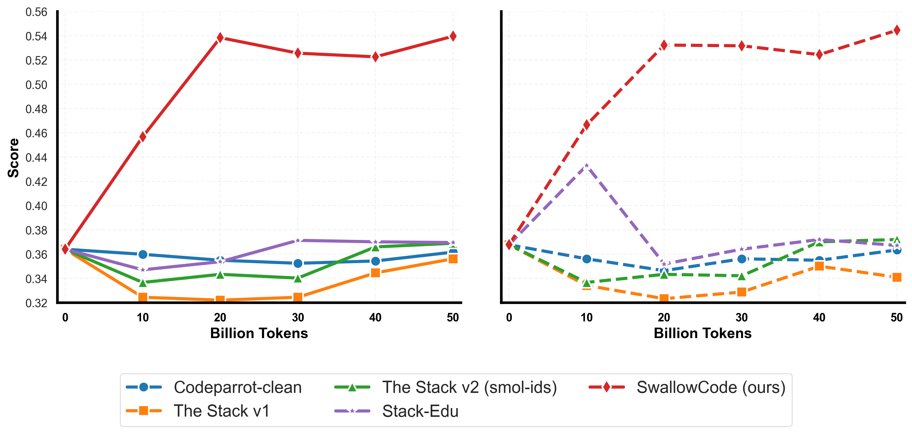
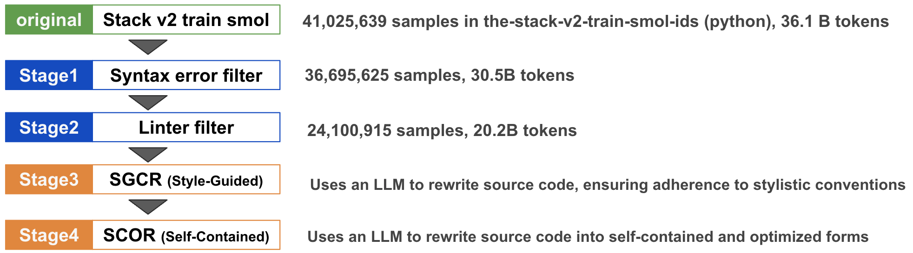
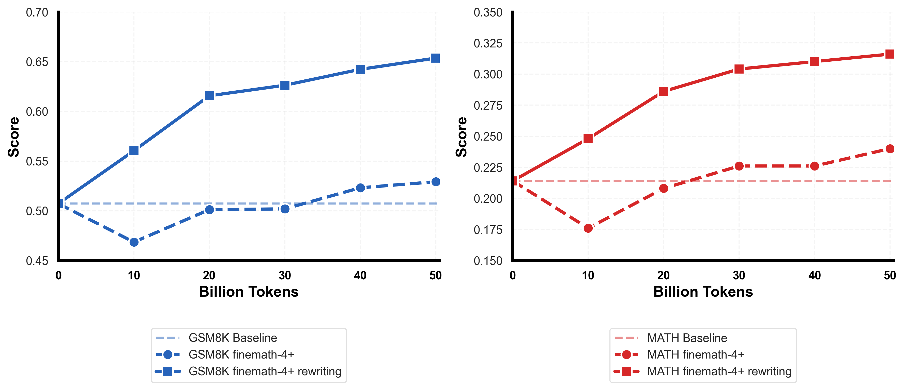

# SwallowCode and SwallowMath

**SwallowCode** and **SwallowMath** are two high-quality, openly licensed datasets designed to enhance the performance of large language models (LLMs) in program synthesis and mathematical reasoning. Derived from public data under the [Llama 3.3 Community License](https://huggingface.co/datasets/tokyotech-llm/swallow-code/blob/main/LICENSE), these datasets address the limitations of existing pre-training corpora by applying rigorous filtering and LLM-driven rewriting to eliminate noise and improve educational value.

- **SwallowCode** (~16.1 billion tokens): A Python code dataset refined from [The-Stack-v2-train-smol-ids](https://huggingface.co/datasets/bigcode/the-stack-v2-train-smol-ids) through a four-stage pipeline involving syntax validation, pylint-based style filtering, and two-stage LLM rewriting (Style-Guided Code Rewriting, SGCR, and Self-Contained Optimization Rewriting, SCOR). It delivers self-contained, algorithmically efficient code snippets.
- **SwallowMath** (~2.3 billion tokens): A mathematical reasoning dataset derived from [FineMath-4+](https://huggingface.co/datasets/HuggingFaceTB/finemath) via LLM rewriting to remove boilerplate, restore missing context, and reformat solutions into concise, step-by-step explanations.

**Datasets**:
- SwallowCode: [https://huggingface.co/datasets/tokyotech-llm/swallow-code](https://huggingface.co/datasets/tokyotech-llm/swallow-code)
- SwallowMath: [https://huggingface.co/datasets/tokyotech-llm/swallow-math](https://huggingface.co/datasets/tokyotech-llm/swallow-math)

**Paper**: [Rewriting Pre-Training Data: Boosting LLM Performance in Math and Code](https://arxiv.org/abs/XXXX.XXXXX)  

## Overview

The performance of LLMs in specialized domains, such as coding and mathematics, is constrained by the quality of the pre-training data. SwallowCode and SwallowMath address this by transforming raw corpora into high-quality, curated datasets through advanced filtering and rewriting techniques. Our experiments demonstrate significant performance gains:
- **SwallowCode**: Improves pass@1 by **+17.0** on HumanEval and **+17.7** on HumanEval+ compared to Stack-Edu in a 50B-token continual pre-training of Llama-3.1-8B.
- **SwallowMath**: Boosts accuracy by **+12.4** on GSM8K and **+7.6** on MATH compared to FineMath-4+ in a similar setting.



## Data Pipelines 🧹

### SwallowCode Pipeline

SwallowCode refines Python code from The-Stack-v2 through a four-stage pipeline, reducing the dataset from 41M to 24.1M samples while enhancing quality:

1. **Programming Language Filter**: Selects Python code exclusively to ensure consistency and facilitate automated evaluation.
2. **Python Syntax Error Filter**: Uses Python’s `compile()` function to remove invalid code, reducing samples by 10.6% (from 41M to 37M).
3. **Linter Filter**: Applies pylint with a score threshold of 7.0 and a custom comment penalty heuristic, further reducing samples by 34.3% (to 24.1M).
4. **LLM Rewriting**:
   - **Style-Guided Code Rewriting (SGCR)**: Enforces Google Python Style Guide criteria using Llama-3.3-70B-Instruct, improving readability and consistency.
   - **Self-Contained Optimization Rewriting (SCOR)**: Ensures self-containment, optimizes algorithms, and transforms trivial snippets into educational examples.



Caption: "Four-stage pipeline for SwallowCode: language filtering, syntax validation, linter filtering, and two-stage LLM rewriting (SGCR and SCOR)."*

The job scripts for the SwallowCode pipeline are located in the [scripts/code/](scripts/code/) directory.

### SwallowMath Pipeline

SwallowMath enhances FineMath-4+ through a tailored LLM rewriting pipeline using Llama-3.3-70B-Instruct:

1. **Boilerplate Removal**: Eliminates web headers, footers, privacy notices, and metadata (e.g., timestamps).
2. **Context Restoration**: Fills in missing information in incomplete questions or answers.
3. **Explanation Reformatting**: Rewrites solutions into concise, step-by-step explanations for clarity and educational value.

Pipeline details, including prompts and scripts, are available in this repository.

The FineMath-4+ rewriting job script is located in the [scripts/math/finemath-4+-rewrite-v1.sh](scripts/math/finemath-4%2B-rewrite-v1.sh) file.

## Ablation Experiments

We conducted extensive ablation experiments to evaluate each pipeline stage, detailed in the [paper](https://arxiv.org/abs/XXXX.XXXXX).

### Training
- **Model**: Llama-3.1-8B, continually pre-trained for 50B tokens.
- **Data Mix**:
  - SwallowCode: 16% code (8B tokens) + 84% multilingual text (Japanese Wikipedia, Japanese Swallow Corpus v2, English Cosmopedia, etc.).
  - SwallowMath: 4.79% math (2.4B tokens), 13% code, 82.2% text.
- **Hardware**: 64 NVIDIA H100 GPUs on the TSUBAME supercomputer.
- **Software**: Megatron-LM (core_r0.9.0), lm-evaluation-harness, BigCodeBench.

### Evaluation
- **SwallowCode**: Ablation datasets (exp1–exp13) are available in the `ablation/` directory of the [SwallowCode dataset](https://huggingface.co/datasets/tokyotech-llm/swallow-code). Experiment 11 (SCOR) achieves the highest performance (HumanEval: 0.5396, HumanEval+: 0.5445 at 50B tokens).
- **SwallowMath**: Experiment 2 (rewritten FineMath-4+) outperforms the baseline (GSM8K: +12.4, MATH: +7.6).



Caption: "FineMath-4+ rewriting: boilerplate removal, context restoration, and explanation reformatting."

Evaluation results and model checkpoints are available in the [SwallowCode](https://huggingface.co/collections/tokyotech-llm/swallowcode-6811c84ff647568547d4e443) and [SwallowMath](https://huggingface.co/collections/tokyotech-llm/swallowmath-6811c89a04efac7df2cd1b66) collections.

## License 📜

Both datasets are released under the [Llama 3.3 Community License](https://huggingface.co/datasets/tokyotech-llm/swallow-code/blob/main/LICENSE). Usage is subject to:
- [The-Stack-v2’s licensing terms](https://huggingface.co/datasets/bigcode/the-stack-v2-train-smol-ids) for SwallowCode.
- [CommonCrawl’s Terms of Use](https://commoncrawl.org/terms-of-use) for both datasets.

## Citation

```bibtex
@misc{fujii2025rewritingpretrainingdata,
      title={Rewriting Pre-Training Data: Boosting LLM Performance in Math and Code},
      author={Kazuki Fujii and Yukito Tajima and Sakae Mizuki and Hinari Shimada and Taihei Shiotani and Koshiro Saito and Masanari Ohi and Masaki Kawamura and Taishi Nakamura and Takumi Okamoto and Shigeki Ishida and Kakeru Hattori and Youmi Ma and Hiroya Takamura and Rio Yokota and Naoaki Okazaki},
      year={2025},
      eprint={XXXX.XXXXX},
      archivePrefix={arXiv},
      primaryClass={cs.CL},
      url={https://arxiv.org/abs/XXXX.XXXXX},
}
